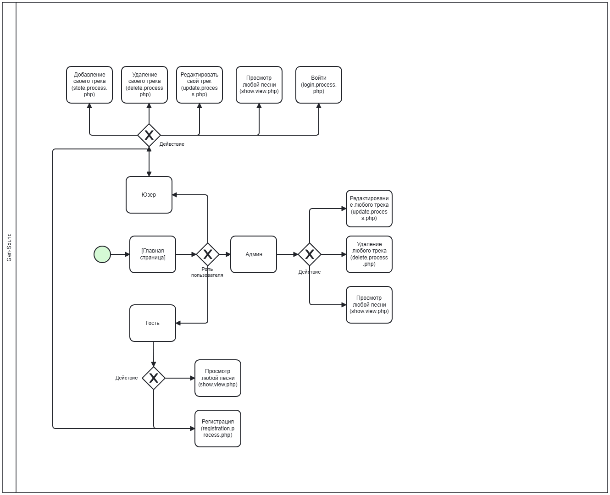

# 🎵 Gen Sound

Платформа для публикации и прослушивания музыкальных треков.


---

## 📌 О проекте

**Gen Sound** — это веб-приложение, где пользователи смогут:
- Регистрироваться и входить в систему
- Загружать свои музыкальные треки
- Добавлять текст песни, обложку и ссылку на музыку
- Редактировать и удалять свои публикации
- Оценивать песни других исполнителей
- Создавать альбомы, собирая свои песни в один шедевр
- Просматривать песни по тегам
- Искать песни по автору, названию трека или альбома

---

## 🚀 Функционал

### Для гостя (неавторизованный пользователь)
- [x] Просмотр списка треков на главной
- [x] Просмотр отдельного трека (текст, обложка, ссылка)
- [x] Регистрация нового аккаунта
- [x] Вход в существующий аккаунт

### Для пользователя (роль user)
- [x] Всё что доступно гостю
- [x] Добавление нового трека
- [x] Редактирование **своих** треков
- [x] Удаление **своих** треков
- [x] Выход из системы

### Для администратора (роль admin)
- [x] Всё что доступно пользователю
- [x] Редактирование **любых** треков
- [x] Удаление **любых** треков

---

## 💼 Бизнес-процесс (BPMN)



---

## 🗄 База данных

### ER-диаграмма (структура таблиц)


### Таблицы и связи

| Таблица | Поля | Связи |
|---------|------|-------|
| **authors** | id, name, password, role | — |
| **tracks** | id, title, author_id, image, lyric, link | `author_id` → `authors.id` |
| **ratings** | id, rate, track_id | `track_id` → `tracks.id` |
| **albums** | id, name, image, author_id | `author_id` → `authors.id` |

### Роли пользователей

| Роль | Права |
|------|-------|
| **guest** | Только просмотр треков |
| **user** | Создание, редактирование и удаление своих треков |
| **admin** | Полный доступ ко всем трекам |

---

## 🛠 Технологии

| Категория | Для чего |
|------------|----------|
| Язык | PHP 7.2 |
| MySQL | База данных |
| HTML, CSS , Bootstrap 5.3 | Структура и стили,  Готовые элементы дизайна |
| Git, GitHub | Хранение кода |
| InfinityFree | Бесплатный хостинг |

---

## 💡 Чем полезен проект

- Начинающие артисты могут выкладывать музыку и получать обратную связь
- Популярные лейблы могут следить за новыми музыкантами
- Музыканты могут находить единомышленников и создавать совместное творчество

---

## 🔧 Установка и запуск

**Рабочий сайт:**

https://gen-sound.infinityfree.me/index.php

**Локальный запуск:**

```bash
git clone https://github.com/Darkprincent/Gen-Sound.git
