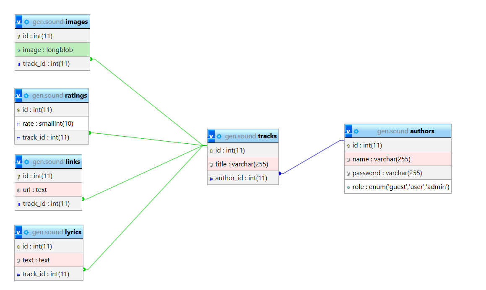

markdown
# 🎵 Gen Sound

Платформа для публикации и прослушивания музыкальных треков.

---

## 📌 О проекте

**Gen Sound** — это веб-приложение, где пользователи смогут:
- Регистрироваться и входить в систему
- Загружать свои музыкальные треки
- Добавлять текст песни, обложку и ссылку на музыку
- Редактировать и удалять свои публикации
- Оценивать песни других исполнителей
- Создавать альблмы собирая свои песни в 1 шедевр
  
---

## 🚀 Функционал

### Для гостя (неавторизованный пользователь)
- [x] Просмотр списка треков на главной
- [x] Просмотр отдельного трека (текст, обложка, ссылка)
- [x] Регистрация нового аккаунта
- [x] Вход в существующий аккаунт

### Для пользователя (роль user)
- [x] Всё что доступно гостю
- [x] Добавление нового трека
- [x] Редактирование **своих** треков
- [x] Удаление **своих** треков
- [x] Выход из системы

### Для администратора (роль admin)
- [x] Всё что доступно пользователю
- [x] Редактирование **любых** треков
- [x] Удаление **любых** треков

---

## 🛠 Технологии

| Категория | Технология |
|-----------|------------|
| Язык | PHP 7+ |
| База данных | MySQL |
| Фронтенд | HTML, CSS, Bootstrap 5 ||

---

## 💡 Чем полезен проект
---
Начинающие артисты будут выкладывать музыку, где их будут просматривать другие люди оценивая их творчество
Популярные лейблы будут следить за новыми музыкантами
Музыканты смогут обзавестись знакомствами и создавать творчество с лругими пользователями
---

## 🔧 Установка и запуск

Ссылка на сайт: https://gen-sound.infinityfree.me/index.php

Или же

git clone [ссылка на репозиторий]
